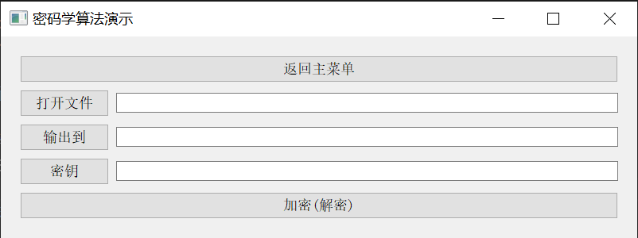

# 密码学作业

## 文件目录

- `cryptProgram`: 项目文件夹, 由QT构建
- `cryptProgram.exe`: 主程序, 已打包, 可直接执行

## 已完成模块

- 异或密码
- DES算法：S盒输入输出情况
- DES算法：改变位的情况
- DH密钥交换协议
- ELGamal
- RSA算法
- 短块加密

## 展示

### 短块加密

主界面

填充加密

密文挪用加密

序列密码加密

### DH协议

### ELGamal

### RSA

### DES

普通加解密

SBox变换

密文改变情况

固定密钥

固定明文

原因: 改变位时, 密钥的8位奇偶校验位也有可能被改变

### 异或密码

主界面

选择文件

待加密文件

进行加密

加密后的文件

选择文件并解密

解密后的文件

